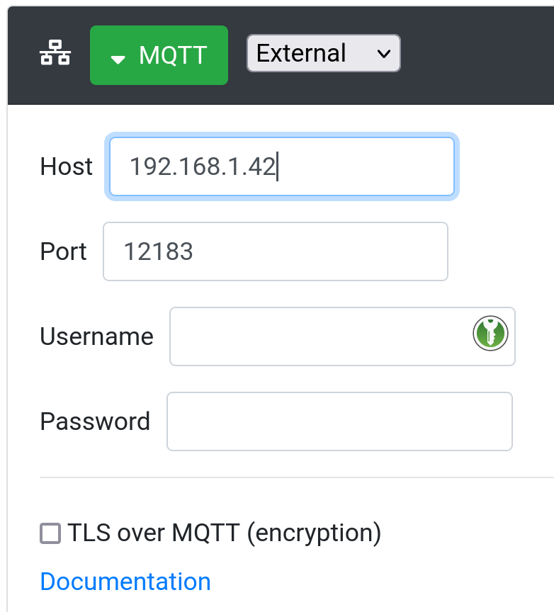
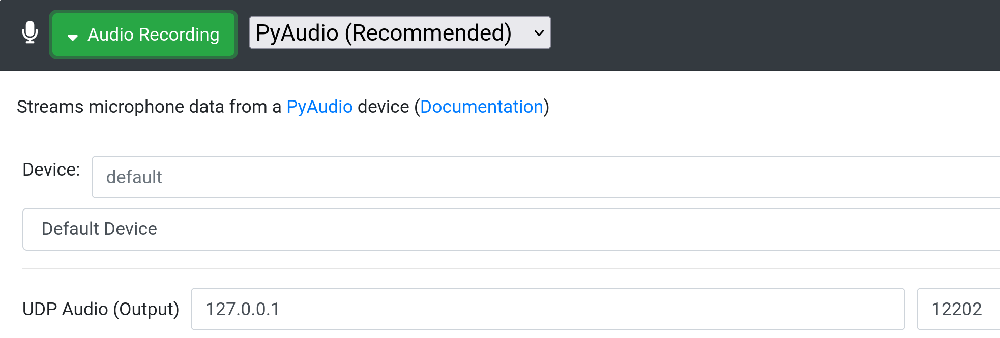
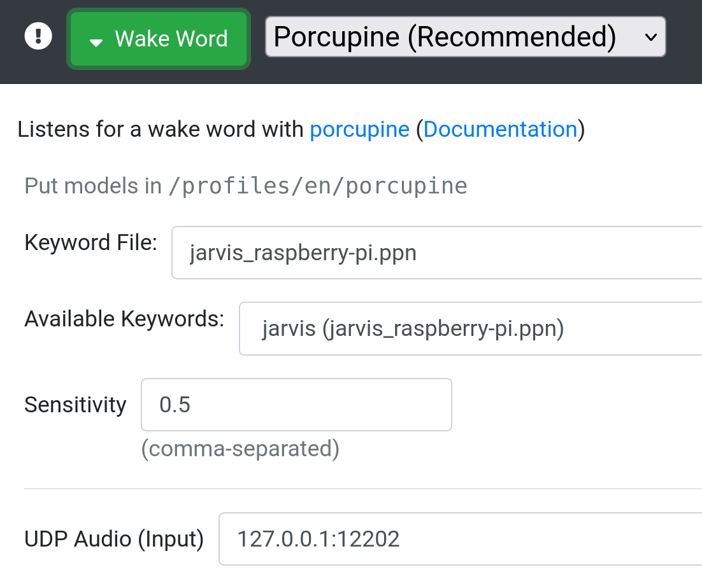
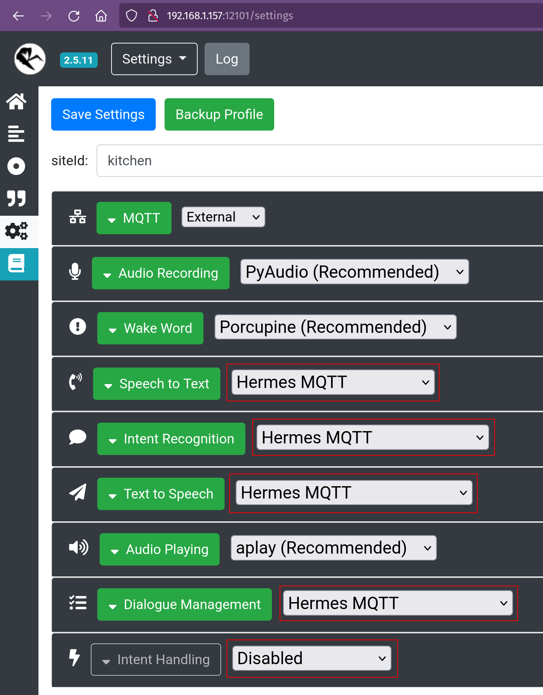
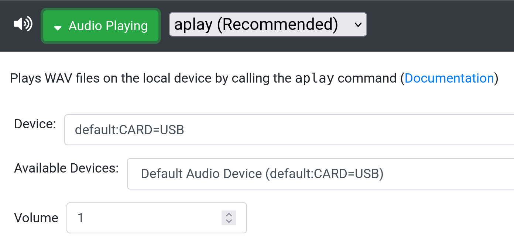

# Satellites

Home Intent now has basic satellite support (released as of 4/2022)! It's a bit more of an involved setup at the moment, but we believe folks who've made it far enough to install Home Intent, should be able to get a satellite working!


## Setting up the Satellite


=== "Automatic Rhasspy"

    You can follow the Rhasspy site's [installation](https://rhasspy.readthedocs.io/en/latest/installation/) page to get the satellite installed on a Raspberry Pi. I've successfully used satellites on Raspberry Pi 0, 3, and 4. After it's been installed, the satellite needs to be configured to point at the main Home Intent instance. If you know the IP Address of the new instance, you can setup Home Intent to configure the Rhasspy satellite for you.


    === "config.yaml"

        To automatically setup a satellite, you just need to add a couple of things to the `config.yaml`:
        ```yaml hl_lines="2-3"
        rhasspy:
          shared_satellite_config:
            mqtt_host: "192.168.1.4"
          
          managed_satellites:
            kitchen:
              ip_address: "192.168.1.157"

            living_room:
              url: "http://livingroom.example.com"
              sounds_device: "default:CARD=USB"
              microphone_device: "0"
        ```

        The `mqtt_host` in `shared_satellite_config` is simply the external host that is running Home Intent/MQTT. Since Home Intent runs in a Docker container, there isn't a reliable way to get this (also affected by a custom networking setup). Regardless, this should just be the IP address (or hostname) that you use to access the frontend. Make sure the MQTT port (12183) is open so satellites can access it. This is in the default configuration in [Getting Started](../installation.md).

        For folks who are using an external MQTT instance (this is not the default setup), you can also provide `mqtt_port`, `mqtt_username`, and/or `mqtt_password` if needed.

        From there it's just the `managed_satellites` section:
        ```yaml hl_lines="5-7"
        rhasspy:
          shared_satellite_config:
            mqtt_host: "192.168.1.4"
          
          managed_satellites:
            kitchen:
              ip_address: "192.168.1.157"

            living_room:
              url: "http://livingroom.example.com"
              sounds_device: "default:CARD=USB"
              microphone_device: "0"
        ```

        `kitchen` is just a reference to the satellite's id and can be whatever unique value you want, and the `ip_address` is the externally accessible IP address that can be connected to. This is used to auto-build the Rhasspy URL, for the `kitchen` it will be `http://192.168.1.157:12101`. If you have some custom networking in place, you can also provide the Rhasspy URL by setting the `url` value (as seen in the `living_room` example).

        From there you can boot up Home Intent and check the logs (either in the console or the UI) to see if the connections were successfully established. If not, ensure the IP address are correct and when you visit them that the Rhasspy interface loads.

        After the connections is established, you _may_ need to setup the microphone/sounds device if it's not picked up by default. In the logs it prints out all the microphone/sounds device and you can try a different one and restart as needed. You can see a `sounds_device` selected above as `default:CARD=USB`. The `microphone_device` uses the index number (as a string) as found in the log output.
        
        ??? Example "Log Output"

            ```
            ====================================================================================================
            Setting up satellite config for kitchen
            ====================================================================================================


            5/15/2022, 11:03:38 AM INFO home_intent.rhasspy_api Trying to connect to Rhasspy at http://192.168.1.157:12101
            5/15/2022, 11:03:38 AM INFO home_intent.audio_config 
            These are the attached microphones (The default has an asterisk):
            {
             "0": "Jabra SPEAK 510 USB: Audio (hw:1,0)*"
            }

            To configure a microphone, set 'microphone_device' to the corresponding number above in the 'rhasspy'->'managed_satellites'->'kitchen' section in '/config/config.yaml'

            5/15/2022, 11:03:38 AM INFO home_intent.audio_config These are the attached sounds devices:
            {
             "default:CARD=USB": "Default Audio Device",
             "default:CARD=vc4hdmi": "Default Audio Device",
             "dmix:CARD=USB,DEV=0": "Direct sample mixing device",
             "dmix:CARD=vc4hdmi,DEV=0": "Direct sample mixing device",
             "dsnoop:CARD=USB,DEV=0": "Direct sample snooping device",
             "dsnoop:CARD=vc4hdmi,DEV=0": "Direct sample snooping device",
             "front:CARD=USB,DEV=0": "Front speakers",
             "front:CARD=vc4hdmi,DEV=0": "Front speakers",
             "hw:CARD=USB,DEV=0": "Direct hardware device without any conversions",
             "hw:CARD=vc4hdmi,DEV=0": "Direct hardware device without any conversions",
             "iec958:CARD=USB,DEV=0": "IEC958 (S/PDIF) Digital Audio Output",
             "iec958:CARD=vc4hdmi,DEV=0": "IEC958 (S/PDIF) Digital Audio Output",
             "jack": "JACK Audio Connection Kit",
             "null": "Discard all samples (playback) or generate zero samples (capture)*",
             "plughw:CARD=USB,DEV=0": "Hardware device with all software conversions",
             "plughw:CARD=vc4hdmi,DEV=0": "Hardware device with all software conversions",
             "pulse": "PulseAudio Sound Server",
             "surround21:CARD=USB,DEV=0": "2.1 Surround output to Front and Subwoofer speakers",
             "surround40:CARD=USB,DEV=0": "4.0 Surround output to Front and Rear speakers",
             "surround41:CARD=USB,DEV=0": "4.1 Surround output to Front, Rear and Subwoofer speakers",
             "surround50:CARD=USB,DEV=0": "5.0 Surround output to Front, Center and Rear speakers",
             "surround51:CARD=USB,DEV=0": "5.1 Surround output to Front, Center, Rear and Subwoofer speakers",
             "surround71:CARD=USB,DEV=0": "7.1 Surround output to Front, Center, Side, Rear and Woofer speakers",
             "sysdefault:CARD=USB": "Default Audio Device",
             "sysdefault:CARD=vc4hdmi": "Default Audio Device",
             "usbstream:CARD=vc4hdmi": "USB Stream Output"
            }

            To configure a sounds device, set 'sounds_device' to the corresponding key (ex: default:CARD=Headphones) above in the 'rhasspy'->'managed_satellites'->'kitchen' section in '/config/config.yaml'. You probably want one of the 'default' devices. The plughw ones can have a fun chipmunk effect!

            5/15/2022, 11:03:38 AM INFO home_intent.audio_config Using default:CARD=USB for aplay device
            5/15/2022, 11:03:38 AM INFO home_intent.audio_config Microphone not set, using default microphone

            5/15/2022, 11:03:38 AM INFO home_intent.home_intent Installing profile
            5/15/2022, 11:03:38 AM INFO home_intent.home_intent Restarting Satellite...
            5/15/2022, 11:03:39 AM INFO home_intent.home_intent Profile is up to date, nothing to download
            5/15/2022, 11:03:39 AM INFO home_intent.home_intent Satellite config complete for kitchen
            ```

        ### Troubleshooting Managed Satellites
        If you see connection timeouts in the logs, you can always try restarting Home Intent which will re-establish a connection. If after a restart, you are still experiencing issues, ensure that the main host running Home Intent can connect to the ip address the satellite is at. This can be done with a simple ping test (ex: `ping 192.168.1.157`). If you are running a more custom networking setup with domain names, you may need to ensure that the host is routable from within a container. 

    === "UI"

        The UI for auto satellite setup has not been completed yet.

=== "Manual Rhasspy"

    You can follow the Rhasspy site's [installation](https://rhasspy.readthedocs.io/en/latest/installation/) page to get the satellite installed on a Raspberry Pi. I've successfully used satellites on Raspberry Pi 0, 3, and 4. After it's been installed, the satellite needs to be configured to point at the main Home Intent instance. The Rhasspy UI should be at the IP address of the server it's running on at port `12101`.

    You can start by putting in a `siteId` at the top of the settings page. I like to name it where the satellite is (in this case `kitchen`).

    {width="600"}


    The MQTT should point at the IP Address that Home Intent is running on, and the associated MQTT port (`12183` - ensure the port is exposed from Docker, this is the case if you're using our provided `docker-compose` file.)

    {width="300"}

    From there, you can setup the microphone and UDP audio in the "Audio Recording" section. The "Test" button next to the Audio Device will narrow down the mic list if the default does't work. The UDP Audio host is set to `127.0.0.1` and the port is `12202`.

    {width="600"}

    Then the "Wakeword" setup. Home Intent uses "Porcupine" with the "Jarvis" wakeword, but any of the other ones should work as well. Regardless of the wakeword chosen, ensure that the `UDP Audio (input)` field matches what was in the "Audio Recording" section, so `127.0.0.1:12202` in our case. The ensures the audio is streamed correctly from the Microphone to the Wakeword service _locally_ and not over _MQTT_.

    {width="600"}

    From here, the "Speech to Text", "Intent Recognition", "Text to Speech", and "Dialogue Management" can all be set to "Hermes MQTT". The Home Intent base station will handle all of this and "Intent Handling" to **disabled** as Home Intent will handle the intents!

    {width="600"}


    The "Audio Playing" section can be used to configure an audio playback device as needed if the default doesn't work for your setup. Below I've set it to use the USB device (a Jabra Speakerphone).

    {width="600"}


    From there, save and let Rhasspy restart, there's just a bit more configuration needed on the Home Intent side to finish up.

    There are other ways to setup Rhasspy as a satellite, but we've found this to work well and be relatively easy to configure. It performs the Wakeword recognition on device (which works fine, even on a Raspberry Pi 0!), and then streams audio packets over MQTT to the base station. This helps the MQTT server not get bogged down with constantly streamed audio. 

    ### Configuring Home Intent for Manual Satellites
    Home Intent and the Satellite will run on two different servers and Home Intent needs to be aware of the Satellite id. You can add a `rhasspy` section to your `config.yaml` and specify the satellite id's in a list.
    
    
    In the `config.yaml` file
    ```yaml
    rhasspy:
      satellite_ids:
       - kitchen
    ```

    ### Testing and Troubleshooting Satellites
    After Home Intent and the Rhasspy satellite are configured, you can say the wakeword and see if it all works. If not double check the site id, the UDP audio settings, and the MQTT options. It also could be an issue with the Microphone/Playback device not getting picked up correctly.
    
    There are a couple of things you can do in order to help troubleshoot from the Rhasspy homepage:
    
     1. If you put type a command in the "Recognize" box (like "Turn on the living room light") and it works, that means that your MQTT settings are correct and the satellite has a connection to the base station. If it doesn't, double check the MQTT settings and make sure the port `12183` is properly mapped from the Docker container.
     2. After, if you put some words in the "Speak" box and click the "Speak" button and don't hear anything, check the "Audio Playing" settings and try a different audio device.
     3. Once you have a playback device, and you're not sure if the mic works, click the "Wake Up" on the homepage and try speaking after you hear the Wakeword sound. If it times out and doesn't pick up what you're saying, go to the "Audio Recording" setting and try another device. Also double check the "UDP Audio (Output)" `host` and `port` are correct and match what's in the "Wakeword" UDP Audio (Input).


=== "Microcontroller/Other"

    I haven't personally tested the microcontroller setup, but as long as the device connects back to Rhasspy over MQTT and has a `siteId`, from the Home Intent side all you need to do is add the `siteId` in the correct section in `config.yaml` and it should work!

    ```yaml
    rhasspy:
      satellite_ids:
       - esp32_kitchen
    ```

## Disable Audio at Base Station
```yaml
rhasspy:
  disable_audio_at_base_station: true
```

There is also the option to disable audio at the base station (`disable_audio_at_base_station`) which can be set to `true` if you are not using the base station to record and playback audio. We've noticed that Rhasspy doesn't like starting up if there isn't a microphone device detected, so be sure to disable the audio at the base station unless a microphone is plugged in.


## Future of Satellites
We'll likely get around to adding satellite id names and disabling the audio from the base station in the UI. From there I really wanted to have Home Intent do more configuration of Satellites from the UI, and even started creating a [dedicated OS](https://github.com/JarvyJ/Rhasspy-Satellite) for a Rhasspy base station. But with the changes coming to Rhasspy, I've dropped the dedicated OS for now. I may resurrect it again in the future.
