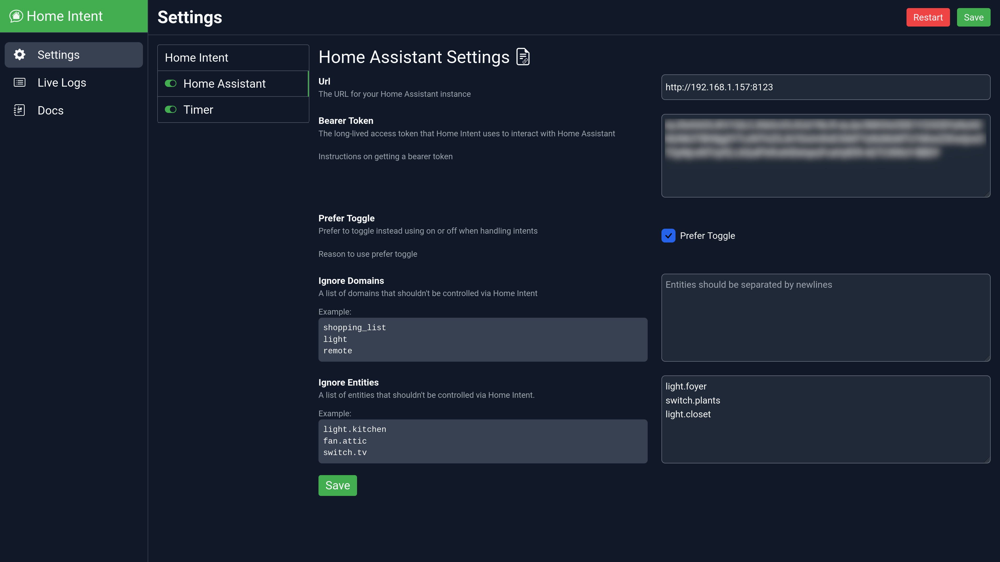
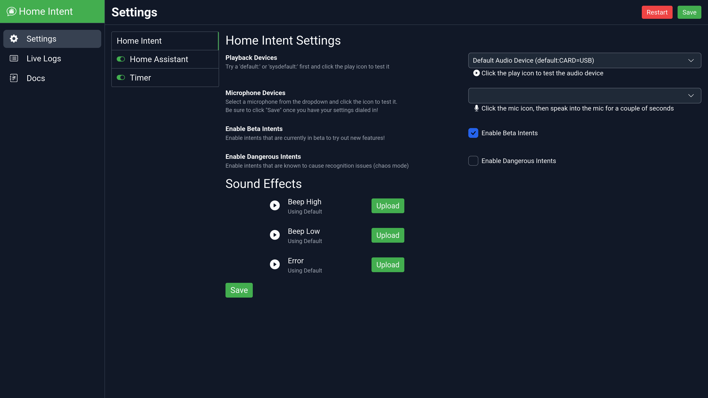

# Customization
There is some simple customization that can be done to make Home Intent work better for you. It's easy to ignore entities you don't want to be voice controlled or setup your own sound effects!

## Home Assistant Customization

### Ignoring Entities

=== "UI"

    In the Home Assistant section in the settings:

    

    There are two options "Ignore Entities" and "Ignore Domains". You can list any entity you don't want to be voice controlled by putting its entity_id from Home Assistant in the list. You can alos specify entire domains from Home Assistant to not be voice controlled.

=== "config.yaml"

    Under the Home Assistant section in `config.yaml` there are two settings objects you can add to ignore entities: `ignore_entities` and `ignore_domains`.

    ```yaml
    home_assistant:
      url: "https://home-assistant-url:8123"
      bearer_token: "eyJ0eXAiOiJKV1Q...**THE REST OF THE TOKEN**"
      ignore_entities:
      	- light.bedroom_1
      	- light.bedroom_2
      ignore_domains:
      	- remote
    ```

    `ignore_entities` will just not allow that specific entity in Home Assistant to be voice controlled and `ignore_domains` will block out entire domains from being controlled.

These are the list of all the currently supported domains:

  * cover
  * fan
  * group
  * light
  * lock
  * remote
  * shopping_list
  * switch

### Overriding Defaults

Home Intent loads color information (list of colors and color temperatures) and shopping items from everyday `txt` and `yaml` files that can be overridden if desired. Instructions on how to do so can be found on the Home Assistant [integration page](../integrations/home-assistant.md#advanced-customization)

## Home Intent Sound Effects (Beeps)
Home Intent uses custom beep sound effects for interaction. You can override them with your sounds if you like!

=== "UI"

    On the main settings page:

    

    Under the "Sound Effects" you can upload your own `.wav` files to override the default sounds. You can click the :material-play-circle: Play icon next to the sound to listen to it.

=== "/config folder"

    You can add your own beep sounds by placing the corresponding `.wav` file in the `/config` folder.

     * Beep high: `/config/beep-high.wav`
     * Beep low: `/config/beep-low.wav`
     * Error: `/config/error.wav`


## Additional Customization
If you don't want to disable entities in their entirety, but rather only with specific intents, you can customize individual [slots and intents](./advanced-features/component-customization.md).
