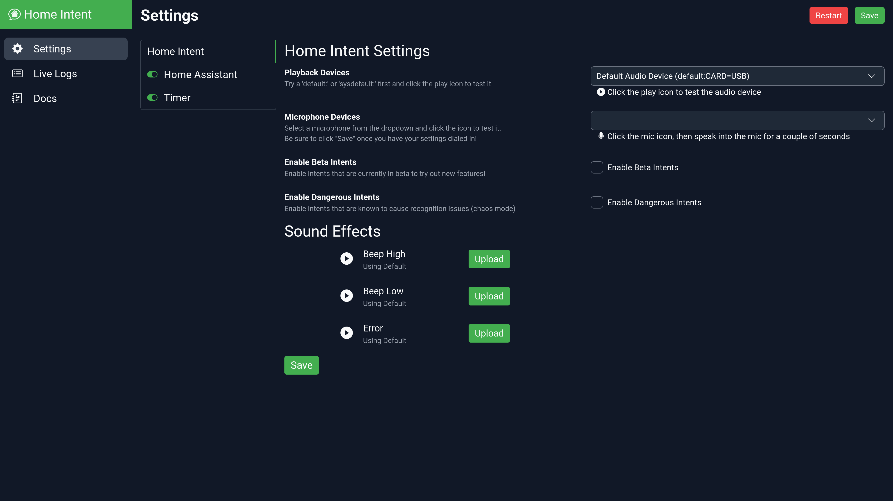
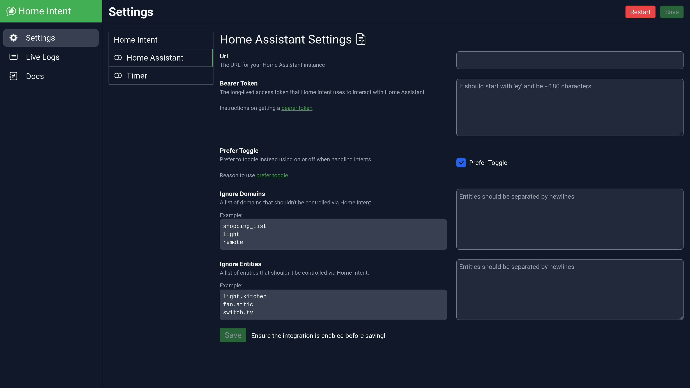
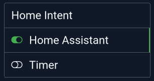

# Getting Started

## Supported Configs

Home Intent currently is designed to run in a docker container running on a Raspberry Pi 3B or 4 (armv7/arm64). We also offer an amd64 build. This can either be the same machine that runs Home Assistant or a different one.

For now, knowledge on using and setting up docker is required. In the future, different setups for installation will be supported!

### Installation Options

  * The default docker based install. Includes everything you need - just continue with this doc!
  * Connect to an [existing Rhasspy setup](./advanced-features/external-rhasspy.md).

## Installation

It is easy to get it started with a `docker-compose.yaml` file that runs Home Intent:

```yaml
version: "3.9"

services:
  homeintent:
    image: "ghcr.io/jarvyj/homeintent:latest"
    restart: unless-stopped
    volumes:
      - "/PATH_TO_CONFIG/rhasspy:/profiles"
      - "/PATH_TO_CONFIG/config:/config"
      - "/etc/localtime:/etc/localtime:ro"
    ports:
      - "11102:11102" # For the Home Intent UI
      - "12183:12183" # For communicating over MQTT/satellites
      - "12101:12101" # For the Rhasspy UI (optional)
    devices:
      - "/dev/snd:/dev/snd"
```
The `/config` directory is where Home Intent configuration lives and the `/profiles` directory is where Rhasspy (the underlying speech system) stores its configs/downloads. The port `11102` exposes the Home Intent web interface, and `12101` exposes the Rhasspy interface.


## Setting the Language
By default Home Intent uses the English language. The ISO 639-1 two letter language code can be used to change the voice interface to a different language using the `LANGUAGE` environment variable. Home Intent currently supports the following:

  * Deutsche (`de`)
  * French (`fr`) - New as of 7/2022!

```yaml
# ... the yaml from above ...
    environment:
      - LANGUAGE=de
```

If you would like to submit a translation, check out our page on [translating components](../../reference/translations/translating-components.md). 

## Setup

After setting up your container configuration, you can finish setting up Home Intent either via the UI or editing `config.yaml` (which lives in `/config/config.yaml` in the container)

=== "UI"

    After starting up the container, you can visit the ip address that Home Intent is running on with the port (`11102`) for the Home Intent (eg: http://192.168.1.157:11102) and it will take you to the "Settings" page.
    

    In the "Playback Devices" dropdown you can select one of the audio interfaces that is connected and press the little :material-play-circle: Play icon underneath the dropdown to ensure that it is working correctly. Usually one of the ones that start with "Default" will work.

    Then in the "Microphone Devices", you can select one of the microphones that is connected. If you click on the little :material-microphone: Microphone icon, Home Intent will listen to the devices and update the dropdown with ones that received audio.

    From there, you can go to the Home Assistant section (you can save everything at the end):
    

    Where in the URL section you can add the URL to your Home Assistant instance, and a Bearer token ("Long Lived Access" token) you can get from your [Home Assistant profile page](../integrations/home-assistant.md#getting-a-bearer-token). From there you can see a couple of other options.


    { align=left }
    Be sure to enable Home Assistant by clicking the toggle next to it (you might as well also enable the Timer!) in the component list, then you can save!

    After saving, it'll restart and set everything up for you!

=== "config.yaml"

    In your config folder, all you need to do is add a `config.yaml`, pointing to your Home Assistant URL and a "Long Lived Access" (bearer) token you can get from your [Home Assistant profile page](../integrations/home-assistant.md#getting-a-bearer-token):

    ```yaml
    home_assistant:
      url: "https://home-assistant-url:8123"
      bearer_token: "eyJ0eXAiOiJKV1Q...**THE REST OF THE TOKEN**"

    timer:

    ```

    and just like that you have Home Intent connected to Home Assistant!

    ## Manual Audio Config
    Home Intent will use the system defaults for speaker and microphone, which may work out of the box. However, if it's not responding or you don't hear any sounds, you may need to add the microphone or speaker to your `config.yaml`.

    When Home Intent starts it will verify sentences and log out Rhasspy's microphone and sounds' devices:
    ```
     These are the attached microphones (the default has an asterisk):
     {
      "0": "HDA Intel PCH: CX8070 Analog (hw:0,0)",
      "1": "sysdefault",
      "10": "vdownmix",
      "11": "default*",
      "12": "dmix",
      "2": "Jabra SPEAK 410 USB: Audio (hw:1,0)",
      "3": "surround40",
      "4": "surround51",
      "5": "surround71",
      "6": "lavrate",
      "7": "samplerate",
      "8": "speexrate",
      "9": "upmix"
     }
    ```

    ```
     These are the attached sounds devices:
     {
      "default:CARD=PCH": "Default Audio Device",
      "default:CARD=Headphones": "Default Audio Device",
      "default:CARD=USB": "Default Audio Device",
      "default:CARD=vc4hdmi": "Default Audio Device",
      "dmix:CARD=PCH,DEV=0": "Direct sample mixing device",
      "dsnoop:CARD=PCH,DEV=0": "Direct sample snooping device",
      "front:CARD=PCH,DEV=0": "Front speakers",
      "hw:CARD=PCH,DEV=0": "Direct hardware device without any conversions",
      "jack": "JACK Audio Connection Kit",
      "null": "Discard all samples (playback) or generate zero samples (capture)*",
      "plughw:CARD=PCH,DEV=0": "Hardware device with all software conversions",
      "pulse": "PulseAudio Sound Server",
      "surround21:CARD=PCH,DEV=0": "2.1 Surround output to Front and Subwoofer speakers",
      "surround40:CARD=PCH,DEV=0": "4.0 Surround output to Front and Rear speakers",
      "surround41:CARD=PCH,DEV=0": "4.1 Surround output to Front, Rear and Subwoofer speakers",
      "surround50:CARD=PCH,DEV=0": "5.0 Surround output to Front, Center and Rear speakers",
      "surround51:CARD=PCH,DEV=0": "5.1 Surround output to Front, Center, Rear and Subwoofer speakers",
      "surround71:CARD=PCH,DEV=0": "7.1 Surround output to Front, Center, Side, Rear and Woofer speakers",
      "sysdefault:CARD=PCH": "Default Audio Device"
     }
    ```

    !!!note
        For the sounds devices, you likely want one of the "default" devices. However, the `plughw` can sometimes make a fun chipmunk effect!

    From the output above, you could change the microphone/speaker in the `rhasspy` config section in `config.yaml`. It uses the 'key' as the identifier:

    ```yaml
    rhasspy:
      microphone_device: "2" # the 2 represents the "Jabra SPEAK 410 USB" above
      sounds_device: "default:CARD=USB"
    ```

## Using Home Intent

The wakeword Home Intent uses is "Jarvis". We have [example sentences](../integrations/home-assistant.md#example-sentences) on the integration page for all the components, but here are a few to get you started:

  * Jarvis, set timer one minute
  * Jarvis, turn on the kitchen light
  * Jarvis, add milk to the shopping list
  * Jarvis, set the bedroom light to red at 80% brightness

After playing around and getting things setup/configured, if you add a new entity in Home Assistant (ex: a light or smart switch), you will need to restart Home Intent for it to pick up the new entity.
