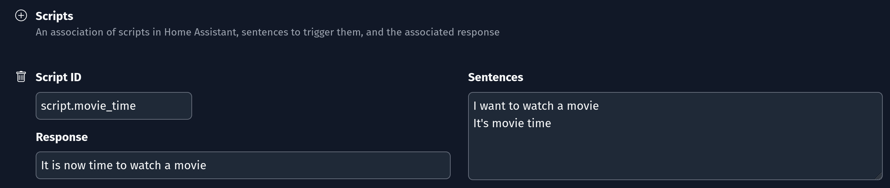

# Home Assistant

Example Config:

```yaml
home_assistant:
  url: "http://my-home-assistant-url:8123"
  bearer_token: "eyJ0eXAiOiJKV1QiLCJhbGci..."
```

!!! note
    The `url` is the URL that you use to access Home Assistant. It supports `https` if using a common certificate provider (like Let's Encrypt). Currently there is no support for a self-signed certificate.

## Getting a bearer token

In Home Assistant, if you go to your "Profile" page (by clicking your username) and scroll to the bottom, there is a section called "Long-Lived Access Tokens". Click on "Create" and give your token a name like "HomeIntent". Copy the token and place it in the config. It will last 10 years. NOTE: I've truncated the token above, but they are quite long.

## Configuration

| Option          | Description                                                                       | Required/Default            |
| :-------------- | :-------------------------------------------------------------------------------- | :-------------------------- |
| url             | The URL for your Home Assistant instance                                          | REQUIRED                    |
| bearer_token    | The long-lived access token that Home Intent uses to interact with Home Assistant | REQUIRED                    |
| prefer_toggle   | Prefer to `toggle` instead using `on` or `off` when handling intents              | `true`                      |
| ignore_domains  | A list of domains from Home Assistant to ignore                                   | `climate, lock, humidifier` |
| ignore_entities | Specific entity id's from Home Assistant to ignore                                |                             |

### New Home Assistant Entity

If you add a new entity in Home Assistant and want to control it via Home Intent, you need to restart Home Intent for it to pick up on new/modified entities. This can easily be done by clicking "Restart" in the Home Intent UI or restarting the container running Home Intent.

### On `prefer_toggle`

After a few years of running various voice assistants, I've noticed that they can really struggle with "on" and "off". It's particularly annoying when you're trying to turn off a light at night and nothing happens. At some point I played with switching it over to "toggle" instead of doing an "on" or "off" and everything works a lot better. This is why `prefer_toggle` defaults to `True`.

Currently `prefer_toggle` is only used for the following:

  * climate
  * fan
  * humidifier
  * light
  * media player
  * remote
  * switch

### On `ignore_domains` defaults

Ignore domains by default includes `climate`, `lock`, and `humidifer` so you can consider the overall risk (financial, safety, or otherwise) if an entity is accidentally triggered (by someone else or from system confusion) in your household.

You can change the setting in the Settings page in the UI or via `config.yaml` in the `home_assistant` section.

To enable just `lock`:

```yaml
home_assistant:
  ignore_domains:
    - "climate"
    - "humidifier"
```

To enable all of them:

```yaml
home_assistant:
  ignore_domains:
    - ""
```

## Scripts

Home Intent can also voice control Home Assistant scripts. It's fully customizable by the user from the sentences spoken to the response from Home Intent.

=== "UI"

    In the Home Assistant settings on the bottom of the page there is a "Scripts" section. Click the :octicons-plus-circle-24: Plus icon next to "Scripts" to add a new script, and the :material-trash-can-outline: Trash icon next to a specific script to delete one.
    

=== "config.yaml"

    ```yaml
    home_assistant:
      scripts:
        script.movie_time:
          sentences:
          - I want to watch a movie
          - It's movie time
          response: It is now time to watch a movie
    ```

## Example Sentences

A lot of the examples sentences try to follow the same pattern. There is a lot of "turn on"/"turn off", open/close, and in one case lock/unlock for activating/deactivating most things. Specifics around components can be found below (like to change light color or something).

### Climate

!!! warning "Climate is ignored by default"

    The climate control is ignored by default and can be enabled by removing it from the [`ignore_domains`](#on-ignore_domains-defaults) setting.

  * Turn on/off the ecobee
  * Set the hvac to 76 degrees
  * Set the window ac to cool (HVAC mode)
  * Set the ecobee high temperature to 80
  * Set the ecobee low temperature to 76 degrees farenheit
  * Turn on/off the hvac aux heat
  * set the ecobee to eco (HVAC preset)

### Cover

  * Open the garage door
  * Close the pergola roof
  * Stop the living room window (works for tilt or open/close)
  * Tilt open the living room window
  * Open the hall window half way

### Fan

  * Turn on/off the living room fan
  * Toggle the ceiling fan
  * \*Set the kitchen fan to [not] oscillate
  * \*Start/stop oscillating the attic fan
  * \*Oscillate the attic fan
  * \*Turn on/off the attic fan osccilation
  * Set/make/change the living room fan to sleep
  * Reverse the ceiling fan
  * Increase/Decrease the kitchen fan
  * Set/make/change the living room fan to high/medium/low

Home Intent will only allow the specific fans that can oscillate to be set for oscillation. Same thing with presets and fan speeds.

We're not sure what the best sentence approach is for the fan oscillation, so we've put in a lot of variation for now. Going to do some tests to see what works well. It performs a toggle under the covers so as long as it picks up the fan and "oscillate" it'll probably work.

### Group

  * Toggle the (basement lights)
  * Turn on the (basement lights)
  * Turn off (super cool lights)

The group friendly names are in parenthesis.

### Humidifier

!!! warning "Humidifier is ignored by default"

    The humidifier control is ignored by default and can be enabled by removing it from the [`ignore_domains`](#on-ignore_domains-defaults) setting.

  * Turn on/off the humidifer
  * Set the humidifier to 68%
  * Set the dehumidifier to 72%
  * Set the hygrostat to eco

### Light

  * Turn on the kitchen light
  * Set the master bedroom light to 80% brightness
  * Make the den red
  * Change the bathroom light to blue
  * Make the kitchen daylight
  * set the kitchen to warm white at 80% brightness

A full list of colors can be found [in the source](https://github.com/JarvyJ/HomeIntent/blob/main/home_intent/default_configs/home_assistant/colors.txt) as well as the [color temperatures](https://github.com/JarvyJ/HomeIntent/blob/main/home_intent/default_configs/home_assistant/color_temperature.yaml).

### Lock

!!! warning "Lock is ignored by default"

    The lock control is ignored by default and can be enabled by removing it from the [`ignore_domains`](#on-ignore_domains-defaults) setting.

  * Lock the front door
  * Unlock the kitchen door
  * Open the front gate (for locks that support opening as well)

### Media Player

Media Player is new as of 7/2022.

  * Turn off the shield
  * Turn on the shield
  * Turn up/down the volume of the chromecast
  * Mute the volume on the chromecast
  * Set the volume of the shield to 90
  * Play/Pause on the chromecast
  * Play next/previous track on the chromecast audio

### Remote

  * Turn on the tv
  * Turn off the tv

### Shopping List

Requires the [shopping_list](https://www.home-assistant.io/integrations/shopping_list/) component in Home Assistant

  * Add oreos to the shopping list
  * Check oreos off the list
  * Uncheck oreos from the shopping list
  * Mark bleach off the shopping list
  * Check everything off the list
  * Unmark everything from the shopping list

Either Check or mark can be used as well as uncheck or unmark. The word shopping is always optional. A full list of shopping items can be found [in the source](https://github.com/JarvyJ/HomeIntent/blob/main/home_intent/default_configs/home_assistant/shopping_items.txt).

### Switch

  * Turn on the fan
  * Turn off the plants
  * toggle basement fan

## Advanced Customization

A lot of the components slot values can be overridden with your own slot values.

A custom defined list of light colors can be placed in `/config/home_assistant/colors.txt` and the default shopping items can be replaced with `/config/home_assistant/shopping_items.txt`. A custom list of color temperatures can be defined at `/config/home_assistant/color_temperature.yaml` in the format of the [default values](https://github.com/JarvyJ/HomeIntent/blob/main/home_intent/default_configs/home_assistant/).

The various Home Assistant sub components can also be customized further using [customization json](../getting-started/advanced-features/component-customization.md) if desired. These are the respective filenames:

  * Climate: `/config/customizations/home_assistant/climate.yaml`
  * Covers: `/config/customizations/home_assistant/cover.yaml`
  * Fans: `/config/customizations/home_assistant/cover.yaml`
  * Groups: `/config/customizations/home_assistant/group.yaml`
  * Humidifier: `/config/customizations/home_assistant/humidifier.yaml`
  * Lights: `/config/customizations/home_assistant/light.yaml`
  * Locks: `/config/customizations/home_assistant/lock.yaml`
  * Media Player: `/config/customization/home_assistant/media_player.yaml`
  * Remote: `/config/customizations/home_assistant/remote.yaml`
  * Shopping List: `/config/customizations/home_assistant/shopping_list.yaml`
  * Switches: `/config/customizations/home_assistant/switch.yaml`
