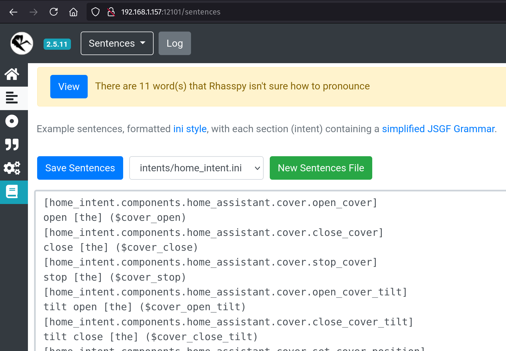
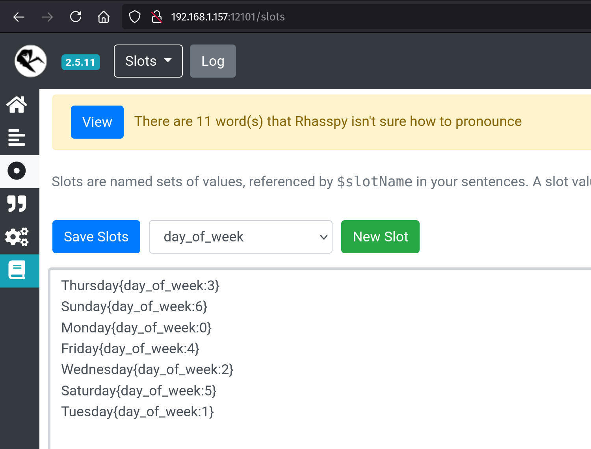

# Translating a Component
Currently only English is supported in Home Intent. We've designed the [structure](./developing-translations.md) of the code to support multiple languages and hope that people can contribute.

Currently translating requires a bit of Docker and git knowledge. We know this is a higher bar for most software translation, but have decided to go for it to allow Python to be used to help bridge translations. Knowing Python is not strictly needed to help with translations, but it would be useful, along with reading the [developing translations guide](./developing-translations.md).

## Enabling another language
To get stated with translation, you will need to set the `LANGUAGE` environment variable to one of the ISO639-1 language codes. The current supported ones are the following:

 - en - English
 - de - German
 - es - Spanish
 - fr - French
 - it - Italian
 - nl - Dutch
 - ru - Russian
 - vi - Vietnamese
 - sv - Swedish
 - cs - Czech

You can do this in the `docker-compose.yaml` file by setting `LANGUAGE` in the `environment` section. Example:
```yaml hl_lines="18-19"
version: "3.9"

services:
  homeintent:
    image: "ghcr.io/jarvyj/homeintent:latest"
    container_name: homeintent
    restart: unless-stopped
    volumes:
      - "/PATH_TO_CONFIG/rhasspy:/profiles"
      - "/PATH_TO_CONFIG/config:/config"
      - "/etc/localtime:/etc/localtime:ro"
    ports:
      - "11102:11102"  # For the Home Intent UI
      - "12183:12183"  # For communicating over MQTT/satellites
      - "12101:12101"  # For the Rhasspy UI (optional)
    devices:
      - "/dev/snd:/dev/snd"
    environment:
      - LANGUAGE=en
```Slots` to see 

Doing this will tell Home Intent to try and load the language version of a component, otherwise it will fallback to English. This might not be the long term behavior (would people speak english for non-translated components?), but is currently how it is setup.

## Testing Translations
To work with Home Intent in a translation capacity, the component code will have to be shared between your computer and the container. This can be done by adding another line to the `volumes` section from above:

```yaml hl_lines="5"
    volumes:
      - "/PATH_TO_CONFIG/rhasspy:/profiles"
      - "/PATH_TO_CONFIG/config:/config"
      - "/etc/localtime:/etc/localtime:ro"
      - "/PATH_TO_COMPONENTS:/usr/src/app/home_intent/components"
```

After running with this config for the first time, Docker will copy out the contents from `home_intent/components` to `/PATH_TO_COMPONENTS`.

## Translating Components
To translate a component, in the components folder (which should exist after kicking off the container for the first time), there are component folders with `en.py` files. You can start by copying the `en.py` file to the language you are translating to (ex: `de.py`, `es.py`, etc), and going through and translating the sentencs/structures to the other language.

```python
from .base_timer import intents, BaseTimer


class Timer(BaseTimer):
    @intents.dictionary_slots
    def partial_time(self):
        return {
            "and [a] half": "half",
            "and [a] quarter": "quarter",
            "and [a] third": "third",
        }

    @intents.sentences(
        [
            "time = 0..128",
            "set timer [(<time>){hours} hours] [(<time>){minutes} minutes] [(<time>){seconds} seconds]",
            "set timer (<time>){hours} [($partial_time)] hours",
            "set timer (<time>){minutes} [($partial_time)] minutes",
            "set timer (<time>){seconds} [($partial_time)] seconds",
            "set a [(<time>){hours} hour] [(<time>){minutes} minute] [(<time>){seconds} second] timer",
            "set a (<time>){hours} [($partial_time)] hour timer",
            "set a (<time>){minutes} [($partial_time)] minute timer",
            "set a (<time>){seconds} [($partial_time)] second timer",
        ]
    )
    def set_timer(
        self, hours: int = None, minutes: int = None, seconds: int = None, partial_time=None
    ):
        return self._set_timer(hours, minutes, seconds, partial_time)

```

This is the `en.py` file from the Timer component. Rhasspy uses a [simplified JSGF](https://rhasspy.readthedocs.io/en/latest/training/#sentencesini) grammar for its sentence structure. This is the most complex component in terms of grammer:

 - Most of the time there will be a `($slot_name)` which will do a substitution with a slot (dictionary or regular).
 - Some of the sentences include things in brackets which are considered `[optional]`.
 - A couple of the sentences use sentence "rules". You can see that with the `time = 0..128` which later gets referenced in the sentence by `(<time>){variable_name}`

These can be mixed and matched to create various types of sentence structures.

When a sentence is spoken, Rhasspy parses out specific types of variables - the `($slot_name)` and `{curly_bracket}`, which then Home Intent picks up and calls the associated function with. In the example above, `set_timer` takes in `hours`, `minutes`, and `seconds` from the `{curly_bracket}` and `partial_time` from the `($slot_name)`

## Testing Translations

From here, you can modify the translation and restart the container to test. If you go to the Rhasspy UI interface: `http://IP_WHERE_RUNNING:12101`, you can click on the `Sentences` tab and click the `intents/home_intent.ini` file to see the sentences and `Slots` tab to see any language specific slots.

Sentences Tab:


Slots Tab:


## Translation Considerations
We always want to keep Home Intent working well and feel professional regardless of what language it is being used in.

### Common Sentence Structure
In English all the sentences try to start with verbs ("Turn on the kitchen light", "Set timer 5 minutes", "Open the garage door", etc). The main idea behind this is to have a sentence structure that is consistent across all types of intents and makes the sentence usage "guessable". So the idea with any of the translations is that once folks understand the sentence structure, they should be able to guess all the variations without much effort.


### Understanding the on/off types of issues
One of the issues we run into in English voice recognition is that "on" and "off" sound very similar and mean very different things. To get around this, for (at least) Home Assistant, there's a [`prefer_toggle`](../../integrations/home-assistant.md#on-prefer_toggle) setting that toggles instead of directly performing the action that was requested. This gets Home Intent to perform the correct action even if it misheard the sentence.

I'm sure this will affect other languages. If they follow the `prefer_toggle` convention, they can use it. But if another language quirk causes "system confusion", please put an issue into the tracker so we can work to resolve it.

### Others
I'm sure while translating we may come across other language considerations that can be used to further improve the quality of Home Intent. Feel free to start a discussion or open an issue to discuss. We'd love to hear about it!


## Checking it back in

TODO: get_file and home_intent.language in developing translations